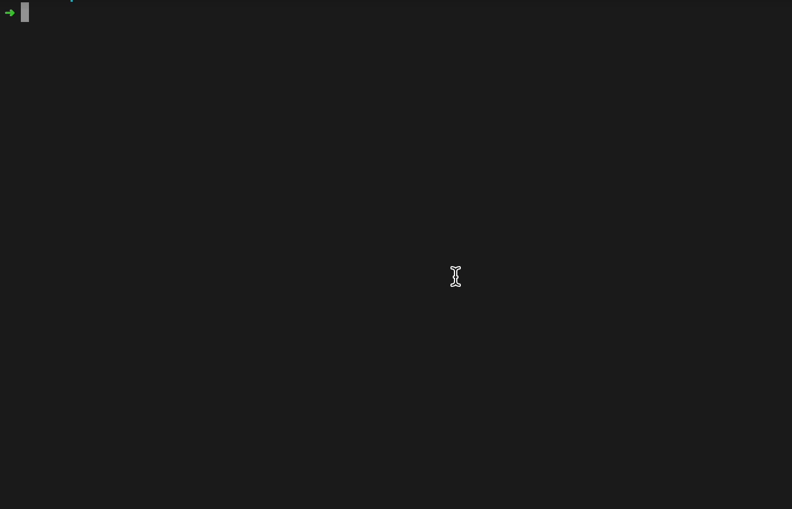

# Shoporusni CLI

A CLI tool for displaying the latest statistics of the Russian military losses.

This Rust application retrieves the latest statistics of Russian military losses from the russianwarship.rip API and displays them in a formatted table. The application is built using the chrono, colored, prettytable, serde, url, and clap Rust libraries.



## Usage

- Install Rust programming language if it's not already installed on your machine. You can do this by following the instructions on the official Rust website: https://www.rust-lang.org/tools/install

- Once Rust is installed, you can install the 'shoporusni' package by running the following command in your terminal:

```bash
cargo install shoporusni
```

This will download the package from crates.io and install it on your machine. The executable file will be installed in the ~/.cargo/bin directory.

- To make the shoporusni package available in all directories on your Mac, you need to add the ~/.cargo/bin directory to your system's PATH environment variable. Here's how you can do it:

Open your shell profile file in a text editor. Depending on your shell, this file can be one of the following:

- `~/.bash_profile` (for Bash)
- `~/.zshrc` (for Zsh)
- `~/.profile` (for some other shells)
  Add the following line at the end of the file:

```bash
export PATH=$PATH:~/.cargo/bin
```

Save the file and close the text editor.

- Reload your shell profile file by running the following command:

```bash
source ~/.bash_profile  # for Bash
source ~/.zshrc         # for Zsh
source ~/.profile       # for some other shells
```

- Test that the shoporusni executable is now available in all directories by running the following command:

```bash
shoporusni --version
```

This should output the version number of the shoporusni package. If it does, you have successfully made the package available in all directories on your Mac.

- Run cli app

```bash
shoporusni -s
```

## Dependencies

The following Rust libraries are used in this application:

`chrono`: Used for working with dates and times.
`colored`: Used for adding color to terminal output.
`prettytable`: Used for formatting tables in the terminal.
`serde`: Used for serializing and deserializing data in JSON format.
`url`: Used for parsing URLs.
`clap`: Used for parsing command-line arguments.

Author
This Rust application was created by Dmytro Barabash dbarabashdev@gmail.com.
